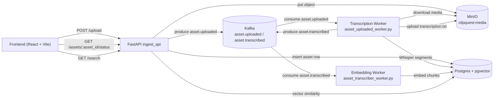
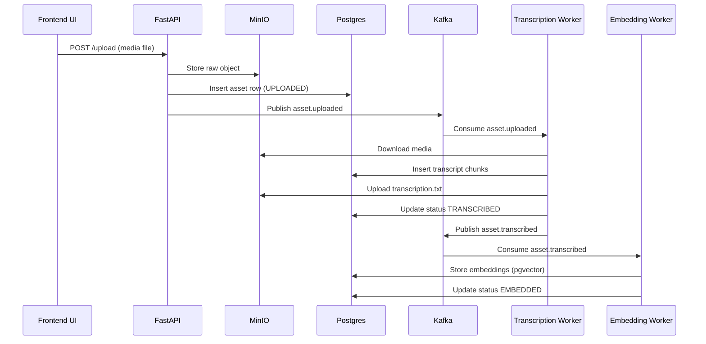
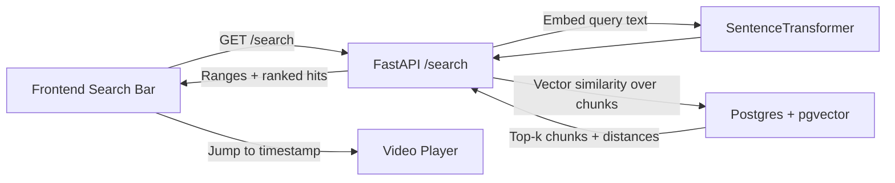

# ClipQuest

ClipQuest is an end-to-end media semantic-search demo:
- Upload media in a React UI
- Store raw assets in MinIO
- Publish pipeline events through Kafka
- Transcribe with Whisper
- Embed transcript chunks into pgvector (Postgres)
- Query semantic matches from the frontend

## What You Get
- Live pipeline graph with node states (`active`, `done`, `error`)
- Live event feed per asset (timestamped)
- Stage progress + latency badges (upload/transcribe/embed/search)
- Prompt chips for fast search demos
- Failure simulation toggle (`OFF`, `Transcribe`, `Embed`)
- Click `Jump` on search hits to seek video playback to the matching chunk start

## Architecture
Open the sections below to inspect each architecture view.

### System Overview Diagram


<details>
<summary><strong>Click to expand: Upload Pipeline (step-by-step)</strong></summary>


</details>

<details>
<summary><strong>Click to expand: Query/Search Flow</strong></summary>


</details>

## Repository Layout
- `frontend/` - React app (pipeline UI + search)
- `backend/` - FastAPI, workers, storage + Postgres integration
- `docker/` - split Docker Compose files (one per service)

## Prerequisites
- Python 3.12+
- Node.js 20+
- Docker + Docker Compose

## Quick Start

### One-Command Docker Stack (Recommended)
The stack is split into service-specific compose files under `docker/` and orchestrated by `Makefile`.

```bash
make up
```

Then open:
- Frontend: `http://localhost:5173`
- API docs: `http://localhost:8000/docs`
- MinIO console: `http://localhost:9090`

Stop everything:
```bash
make down
```

Reset all container data volumes:
```bash
make reset
```

### Make Shortcuts
Use the root `Makefile` for faster local workflows:

```bash
make up       # start stack in background, wait for services, print URLs
make down     # docker compose down
make reset    # docker compose down -v --remove-orphans
make logs     # follow logs for all services
make ps       # show service status
make build    # build images only
make restart  # full down + up --build
```

### Optional: Local Python/Node Dev (without app containers)
If you only want infra in Docker (Kafka/Postgres/MinIO) and run API/workers/frontend locally:

```bash
docker compose \
  -f docker/compose.base.yml \
  -f docker/kafka.compose.yml \
  -f docker/postgres.compose.yml \
  -f docker/minio.compose.yml \
  up -d
```

## API Endpoints
- `POST /upload` - upload media; creates asset row + Kafka event
- `GET /assets/{asset_id}/status` - current pipeline status and counters
- `GET /search?asset_id=...&q=...&k=8` - semantic vector search results

## Demo Script
1. Upload a video.
2. Show live pipeline graph transitioning node-by-node.
3. Open event feed and point to stage events in order.
4. Run prompt-chip queries (`explain kafka flow`, `where whisper timestamps are created`, `embedding pipeline details`).
5. Click `Jump` to seek directly to the matched video moment.
6. Toggle failure simulation and upload another asset to show graceful error handling.

## Notes
- If MinIO auth fails (`InvalidAccessKeyId`), verify env vars match the running MinIO container.
- Frontend expects backend at `http://127.0.0.1:8000` by default. Override with:
  - `VITE_API_BASE_URL=http://your-host:8000`
